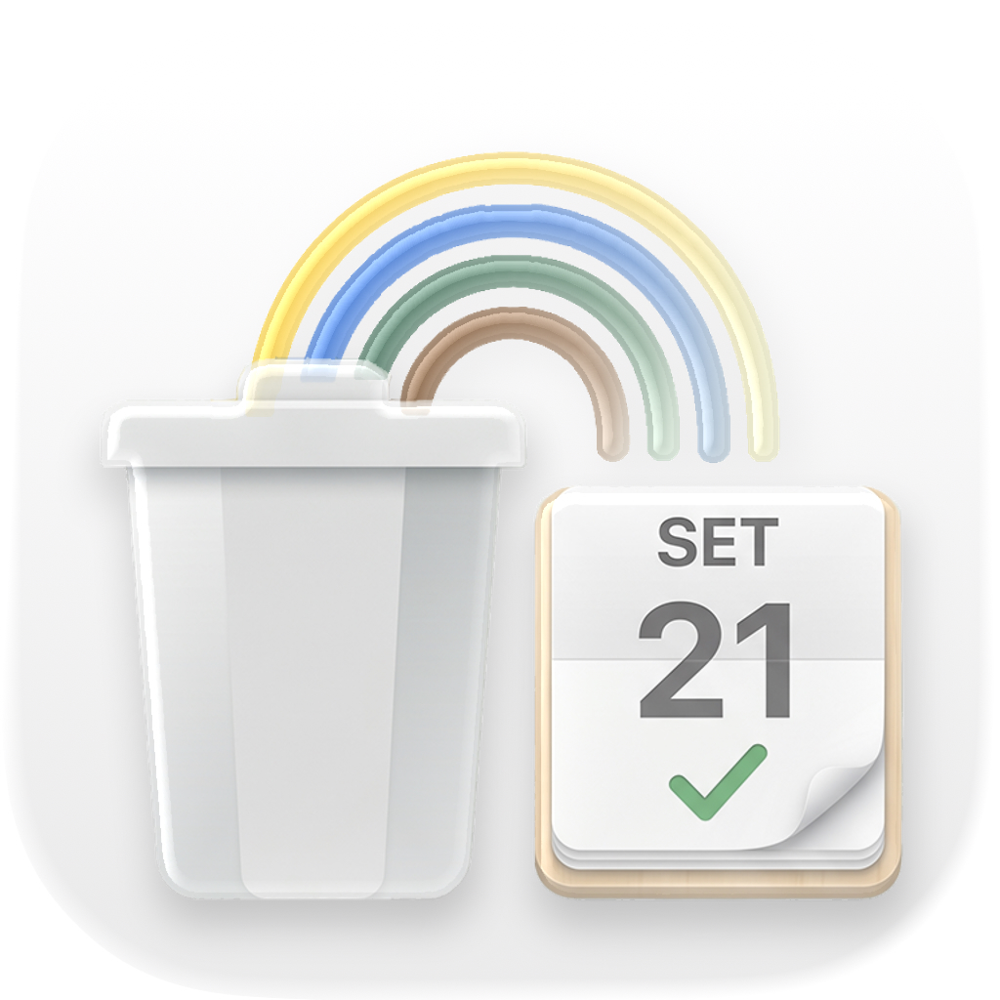

<p align="center">
  
</p>

<h1 align="center">
  🗑️ Differenziata
</h1>

<p align="center">
  <strong>Non sbagli mai più la raccolta differenziata.</strong>
  <br>
  <em>iOS app + Widget — sappi sempre cosa esporre, quando e dove.</em>
</p>

<p align="center">
  
  
  
  
  
  
  
</p>

---

## ✨ Cos'è

**Differenziata** è un'app nativa iOS che ti dice **cosa devi buttare stasera** per la raccolta di domattina. Non serve più ricordarsi a memoria il calendario: configuri una volta il tuo comune e i giorni di ritiro, e l'app si occupa del resto.

- 🔍 **Cerca un oggetto** e scopri subito in quale contenitore va e quando passa il prossimo ritiro.
- 🔔 **Promemoria serali** automatici (con azione "Ho buttato" e confetti 🎉).
- 📱 **Widget** sulla home: un colpo d'occhio e sai già cosa esporre.
- ☁️ **Profili cloud** — configura una volta, riusa su più dispositivi.
- 📍 **GPS** — trova automaticamente il tuo comune.
- 🎨 **Design pulito** con gradienti, card e animazioni fluide.

---

## 📸 Screenshot

| Home | Ricerca | Setup | Setup 2 |
|:---:|:---:|:---:|:---:|
|  |  |  |  |
| Home principale con calendario settimanale e cosa esporre domani | Cerca oggetti — risultati con contenitore, sacchetto e prossimo ritiro | Setup wizard — configurazione comune e giorni di raccolta | Riepilogo e salvataggio profilo |

---

## 🚀 Funzionalità

### 🎯 Home intelligente
- **"Da esporre adesso"** — la card principale ti dice cosa mettere fuori stasera in base a domani
- **Calendario settimanale** completo con il giorno corrente evidenziato
- **"Oggi" badge** sulla riga corrente per orientarti subito
- **Pannolini** — supporto per il servizio di raccolta pannolini supplementare

### 🔍 Dove lo butto? (Ricerca oggetti)
Più di **100 oggetti** indicizzati con:
- Ricerca fuzzy con alias (es. "penna bic", "biro", "penne" → Secco Residuale)
- Risultati con: contenitore, tipo sacchetto, prossimo ritiro, giorni di raccolta
- Suggerimenti rapidi e autocomplete
- Link diretto al foglio informativo dettagliato di ogni materiale

### 📋 Catalogo materiali
6 categorie complete con cosa **inserire** e cosa **NON inserire**:
| Materiale | Contenitore | Sacchetto |
|:---------|:-----------|:---------|
| 🟤 **Organico** | Marrone | Biodegradabile |
| ⚫ **Secco residuale** | Grigio | Trasparente |
| 🟢 **Vetro** | Verde | Nessuno |
| 🟡 **Plastica** | Giallo | Trasparente |
| 🔵 **Carta e cartone** | Blu | Nessuno |
| 🟢 **Metallo** | Verde | Nessuno |

### 🔔 Notifiche intelligenti
- **Promemoria serale** personalizzabile (default 22:00)
- **Categoria notifica** con azioni:
  - ✅ **"Ho buttato"** — scatena una pioggia di 🎊 **confetti** nell'app!
  - ⏰ **"Ricordamelo dopo"** — riprogramma tra 30 minuti
- Compatibile con **Focus Mode** e **StandBy**

### 📱 Widget iOS
- **Small:** materiale principale + icona
- **Medium:** griglia completa con tutti i materiali di domani
- **Dati condivisi** tra app e widget via **App Group**
- Aggiornamento automatico ogni 2 ore o a mezzanotte

### 🏙️ Setup flessibile
- **3-step wizard** con interfaccia pulita
- **Autocomplete comuni** via Nominatim/OpenStreetMap (gratuito, nessuna API key)
- **GPS** — un tap per trovarti il comune
- **Profili cloud** — se un altro utente ha già configurato il tuo comune, lo carichi in un tap
- Modifica il profilo in qualsiasi momento dal calendario

### ☁️ Backend cloud
- API PHP leggera (`api.php`)
- Database MySQL/MariaDB per salvare e condividere profili
- **Best-effort** — l'app funziona perfettamente anche offline

---

## 🏗️ Architettura

```
Differenziata.app
├── DifferenziataApp.swift          ← @main, App + AppDelegate
├── AppRootView.swift                ← Onboarding / Home router
├── ContentView.swift                ← Home principale (scroll, card, ricerca)
├── MunicipalitySetupFlow.swift      ← Setup wizard (3 step + GPS)
├── WasteProfileStore.swift          ← Singleton profilo (UserDefaults + App Group)
├── NotificationSupport.swift        ← Notifiche + Confetti + AppDelegate
├── DatabaseService.swift            ← API HTTP client
├── APIConfig.swift                  ← URL backend
│
├── WidgetExtension/                 ← iOS Widget (small + medium)
│   ├── DifferenziataWidget.swift
│   ├── DifferenziataProvider.swift
│   ├── DifferenziataWidgetViews.swift
│   └── DifferenziataEntry.swift
│
├── Shared/                          ← Condivisione App Group
│   └── AppGroupUserDefaults.swift
│
└── database/                        ← Backend
    ├── api.php                      ← API REST PHP
    └── database.sql                 ← Schema MySQL
```

### Pattern
- **MVVM** con `ObservableObject` / `@Published`
- **Singleton** per `WasteProfileStore` e `WasteNotificationManager`
- **Enum namespace** per `WasteCatalog`, `WasteSchedule`, `WasteSearchIndex`
- **App Group** `group.it.alessandrodigiusto.Differenziata` per widget
- **Best-effort cloud sync** — il salvataggio remoto non blocca l'UX

---

## 🛠️ Tech Stack

| Layer | Tecnologia |
|:------|:-----------|
| **Linguaggio** | Swift 5.9 |
| **UI** | SwiftUI 5 (iOS 17+) |
| **Widget** | WidgetKit |
| **Notifiche** | UserNotifications + UNNotificationCategory |
| **Localizzazione** | Locale `it_IT` |
| **Persistenza** | UserDefaults + JSON Codable |
| **Condivisione** | App Group |
| **GPS** | CoreLocation |
| **Backend** | PHP 8.0 |
| **Database** | MySQL 8.0 / MariaDB 10.11 |
| **API Geocoding** | Nominatim (OpenStreetMap) — gratuito |
| **Anagrammi** | Nessuna dipendenza esterna (tutto vanilla) |

---

## 🧑‍💻 Setup Locale

### 1. Clona il repo
```bash
git clone https://github.com/tuo-username/Differenziata-_iOS_App.git
cd Differenziata-_iOS_App
```

### 2. Apri in Xcode
```bash
open Differenziata.xcodeproj
```

### 3. Configura App Group
1. Seleziona **Differenziata** target → **Signing & Capabilities**
2. Aggiungi **App Groups** → `group.it.alessandrodigiusto.Differenziata`
3. Stessa cosa per **WidgetExtension** target

### 4. Configura backend (opzionale, per cloud sync)
Crea un database MySQL e importa lo schema:

```bash
mysql -u tuo_utente -p nome_database < database/database.sql
```

Carica `database/api.php` sul tuo hosting e imposta le credenziali:

```php
$DB_HOST = 'il_tuo_host';
$DB_NAME = 'il_tuo_database';
$DB_USER = 'il_tuo_utente';
$DB_PASS = 'la_tua_password';
```

Poi aggiorna l'URL in `APIConfig.swift`:

```swift
static let apiBaseURL = "https://tuodominio.it/api.php"
```

### 5. Build & Run
Seleziona un simulator iOS 17+ e premi ▶️.

---

## 📦 Backend API

```
GET  api.php?action=profili
  → Lista comuni con profilo salvato

GET  api.php?action=profilo&comune=Acireale
  → Dettaglio profilo di un comune

POST api.php?action=salva
  → Crea/aggiorna profilo (body: { comune_nome, profile_json })

GET  api.php?action=comuni&q=acir
  → Cerca comuni italiani (Nominatim)

GET  api.php?action=comune_vicino&lat=37.612&lon=15.166
  → Trova comune da coordinate GPS
```

---

## 🔮 Roadmap

- [ ] **Dark mode** support
- [ ] **Dynamic Type** e VoiceOver per accessibilità
- [ ] **Festività** — gestione automatica dei giorni festivi (nessun ritiro)
- [ ] **Notifiche settimanali** riepilogo completo
- [ ] **Più comuni** — supporto per più profili contemporaneamente
- [ ] **Apple Watch** companion app
- [ ] **Lock Screen widget** (iOS 16+)
- [ ] **Localizzazione** inglese
- [ ] **Test unitari** e UI test

---

## 👤 Autore

**Alessandro Di Giusto**  
📱 iOS Developer, appassionato di UX e sostenibilità.

- GitHub: [@alessandrodigiusto](https://github.com/alessandrodigiusto)
- Web: [alessandrodigiusto.it](https://alessandrodigiusto.it)

---

## 📄 Licenza

Distribuito sotto licenza **MIT**.  
Vedi [LICENSE](LICENSE) per maggiori informazioni.

---

<p align="center">
  <strong>🌍 Differenziata — per un pianeta più pulito, un rifiuto alla volta.</strong>
  <br>
  <sub>Costruito con ❤️ in Sicilia, Italia.</sub>
</p>
